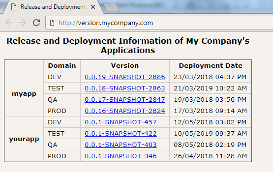

**cat**_farm_ is a tool that lets DevOps teams to manage Apache Tomcat instances spread over multiple hosts(nodes), easily.

It is quite an old project, actually. **cat**_farm_'s ancestors have been used in many production environments since 2008. We, however, prefer cloud platforms and Docker based solutions today.

```
+---------------------------------------------------------------------------------------------+
|  domain1 (DEV, TEST, QA, PROD etc.)                                                         |
|                                                                                             |
|    +-----------------------+  +-----------------------+        +-----------------------+    |
|    | node1                 |  | node2                 |        | nodeN                 |    |
|    |                       |  |                       |        |                       |    |
|    | +-------------------+ |  | +-------------------+ |        | +-------------------+ |    |
|    | |     instance1     | |  | |    instanceN+1    | |        | |   instanceN*N+1   | |    |
|    | +-------------------+ |  | +-------------------+ |        | +-------------------+ |    |
|    | +-------------------+ |  | +-------------------+ |        | +-------------------+ |    |
|    | |     instance2     | |  | |    instanceN+2    | |  ...   | |   instanceN*N+2   | |    |
|    | +-------------------+ |  | +-------------------+ |        | +-------------------+ |    |
|    |         ...           |  |         ...           |        |         ...           |    |
|    | +-------------------+ |  | +-------------------+ |        | +-------------------+ |    |
|    | |     instanceN     | |  | |    instanceN+N    | |        | |   instanceN*N+N   | |    |
|    | +-------------------+ |  | +-------------------+ |        | +-------------------+ |    |
|    |                       |  |                       |        |                       |    |
|    +-----------------------+  +-----------------------+        +-----------------------+    |
|                                                                                             |
+---------------------------------------------------------------------------------------------+
```

**instance:** Tomcat installation.

**node:** Each host is also a node that might consist of multiple instances.

**domain:** Tomcat instances spread over multiple hosts(nodes).

# Features

* Easy setup (A node can be prepared and an instance can be created in less than one minute)
* Vertical and horizontal scalability
* Deployment without service interruption
* No single point of failure(SPOF) as there is no admin node. Management can be done on either node.
* Agentless. `ssh`, `scp` and key-based authentication between nodes are our good old friends.
* Supports data and database schema upgrades via Flyway.
* Continues delivery friendly (Management can be done via Ant script from any machine)
* Convention over configuration
* No port conflicts and manual port configuration. Ports are dynamically generated from application's base port and instance's name.

# Considerations

* Runs on Linux/Unix
* Supports HotSpot, IBM and OpenJDK JVMs
* Supports Java 7 and later
* Supports Tomcat 7 and can easily be tweaked to support higher versions
* Each node under the same domain must be able to connect to each other with ssh via key-based authentication.
* As a Tomcat farm, it expects;
   * the same Tomcat version is used for each instance on each node
   * the same Tomcat, node and application configuration for all the instances either on the same or different nodes.
* The Ant script(`build.xml`) uses `ant-contrib`, `jsch` and `Flyway` libraries. Put their jars to Ant's lib directory.
* The host on which Ant script runs must be able to access to all the nodes via ssh/scp. Key-based authentication must be provided, as well.


# Installation

* Install supported JDK (HotSpot, IBM or OpenJDK)
* Download Tomcat package from https://tomcat.apache.org (e.g. `apache-tomcat-7.0.88.tar.gz`)
* Clone the project: `git clone https://github.com/kumlali/catfarm`
* Follow the "CUSTOMIZE: ..." directives in `build.xml` and update them according to your environment.
* Create/update each domain's property file under `properties` directory. You must have a property file for each domain. (e.g. `dev.properties`, `test.properties`, `qa.properties`, `prod.properties`, etc.)
* Create `app.zip`, `instance.zip` and `node.zip` files to be deployed by executing 

      ant -Ddomain=dev -Dversion=myapp-0.0.1-SNAPSHOT create-deployment-packs

  under `catfarm` directory. Use your own domain instead of `dev` and artifact version instead of `myapp-0.0.1-SNAPSHOT`.
* Copy Tomcat package and `node.zip` to all the nodes.
* On each node:
    * Create application's home directory (e.g. `/home/myuser/myapp`).
    * Unzip `node.zip` to application's home directory.
    * `.sh` files under `bin` directory should have permissions of 755 (e.g. `chmod +x /home/myuser/myapp/bin/*.sh`).
    * Extract directories and files _inside_ `apache-tomcat-...` directory of Tomcat package to `instances/template` (e.g. `/home/myuser/myapp/instances/template`). You should have `instances/template/bin`, `instances/template/conf`, etc. directories.
* Copy `app.zip`, `instance.zip` and `node.zip` to all the nodes by executing

      ant -Ddomain=dev copy-deployment-packs-to-domain

  under `catfarm` directory. Use your own domain instead of `dev`.
* On each node:
    * Create instances by executing
    
          ./instance.sh myapp01 create 
      
      under `/home/myuser/myapp/bin` directory and following the instructions. You should provide your instance's name instead of `myapp01`. Instance names are expected to contain application's name and instance id (e.g. `myapp01`, `myapp02`, etc.)
    
      Instructions help you make deployment for each new instance. If you do not want to repeat deployment step for each instance on each node, execute 

          ant -Ddomain=dev deploy

      under `catfarm` directory. Use your own domain instead of `dev`.

    * If you want to automatically start the instances after the host reboots:
      * Update application's name and path in `myapp.init`
      * Rename `myapp.init` to `<yourapp>.init` according to your application's name. Here, `<yourapp>` part will be the service name.
      * Copy the init script to `/etc/init.d` directory: `sudo cp <yourapp>.init /etc/init.d`
      * Register the service: `sudo chkconfig --add <yourapp>`
      * Enable the service: `sudo chkconfig <yourapp> on`
  
      Note: This is System V sample. You might want to use Upstart or systemd instead of System V. Then, you should create your own script by examining `myapp.init`.


# Usage
**cat**_farm_ is essentially a bunch of scripts and their configurations.

## `instance.sh`

Each Tomcat installation under `instances` directory is an _instance_. `instance.sh` manages tasks executed on a single instance. (e.g. `create`, `start`, `stop`, `restart`, `deploy`, etc.)

Usage:

    ./instance.sh <instance_name> <command>

    Commands:

      archive-logs            : Archives the instance's log files if it is not running.

      create                  : Creates (but does not start) an instance on the current node,
                                if it does not already exist on any nodes and its name conforms to
                                myapp<number> pattern. (e.g. myapp01, myapp17, etc.)

      delete                  : Deletes the instance on the current node, if it exists and does not run.

      delete-logs             : Deletes the instance's log files if it is not running.

      deploy                  : Deploys 'instance.zip' and 'app.zip', if the instance is not running.

      take-thread-dump        : Takes thread dump from instance's JVM.

      is-alive                : Returns 'true' if the instance is running and 'false' otherwise.

      restart                 : Stops and then starts the instance.

      restart-verify          : Stops and then starts the instance. It blocks until the instance
                                has been started successfully or an error occurs.

      show-log                : Opens the instance's 'catalina.out' log file with 'less' command.

      start                   : Archives the instance's logs, then starts it. It neither blocks nor
                                checks for failures while the instance is starting up.

      start-memusage-recording: Starts to record memory usage data of the instance.

      start-verify            : Archives the instance's logs, then starts it. It blocks until
                                the instance has been started successfully or an error occurs.

      status                  : Logs status of the instance (running or not).

      stop                    : Stops the instance. Process is killed if it does not stop in
                                30 seconds.

      stop-memusage-recording : Stops to record memory usage data of the instance.

      tail-log                : Follows the instance's 'catalina.out' log file. Ctrl+C can be
                                used to exit.

    Examples:

      ./instance.sh myapp1 start-verify
      ./instance.sh myapp1 stop
      ./instance.sh myapp1 deploy
      ./instance.sh myapp1 restart


## `node.sh`

Each host is also a node.

Manages tasks executed on a single _node_ such as `create`, `start`, `stop`, `restart` and `deploy` as well as node specific tasks such as `archive` and `restore`.

It simply executes `instance.sh` for all the instances in the same node.

Usage:

    ./node.sh <command>

    Commands:

      archive       : Moves latest deployment artifacts('app.zip', 'node.zip' and
                      'instance.zip') under deployment directory(latest) to archive .

      deploy        : Deploys 'node.zip' to the node, then deploys 'app.zip' and
                      'instance.zip' to all the instances of the node parallelly.

      is-alive      : Returns 'true' if at least one instance on the node is running,
                      returns 'false' otherwise.

      restart       : Restarts all the instances of the node parallelly.

      restart-ha    : Stops and starts all the instances on the node one by one.
                      It does not stop next instance before the current one starts
                      successfully.

      restart-verify: Restarts all the instances of the node parallelly. It blocks
                      until all the instances start successfully or one of them
                      fails to start.

      restore       : Moves archived deployment artifacts('app.zip', 'node.zip' and
                      'instance.zip') under 'previous' directory to deployment
                      directory (latest). To deploy them, you need to execute 'deploy'
                      command.

      start         : Starts all the instances on the node parallelly. It neither
                      blocks nor checks for failures while the instances are starting up.

      start-verify  : Starts all the instances of the node parallelly. It blocks until
                      all the instances start successfully or one of them fails to start.

      status        : Logs status of each instance on the node (running or not).

      stop          : Stops all the instances on the node parallelly. If it does not
                      complete in 30 seconds, the processes are killed.


    Examples:

      ./node.sh start-verify
      ./node.sh stop
      ./node.sh restart-ha
      ./node.sh deploy


## `domain.sh`

Manages domain related tasks such as `create`, `start`, `stop`, `restart` and `deploy` as well as node specific tasks such as `deploy-ha`.

It simply executes `node.sh` for all the nodes in the same domain.

Usage: 

    ./domain.sh <command>

    Commands:

      archive       : Moves latest deployment artifacts('app.zip', 'node.zip' and
                      'instance.zip') under deployment directory(latest) to archive
                      on all the nodes parallelly.

      deploy        : Deploys 'node.zip' to the node, then deploys 'app.zip' and
                      'instance.zip' to all the instances of the node parallelly.
                      These operations are executed on the nodes parallelly.

      deploy-ha     : Deploys 'node.zip' to the node, then deploys 'app.zip' and
                      'instance.zip' to all the instances of the node parallelly.
                      These operations are executed on all the nodes sequentially.
                      To achive this, it deploys applications and artifacts on a
                      node, waits for a while, then passes to the next node for
                      the same operation. Therefore, there will be no service
                      interruption.

      is-alive      : Returns 'true' if at least one instance on either node is
                      running, returns 'false' otherwise.

      restart       : Restarts all the instances on all the nodes parallelly. It
                      neither blocks nor checks for failures while the instances
                      are starting up.

      restart-ha    : Restarts and verifies all the instances on a node parallelly,
                      waits for a while, then passes to the next node for the same
                      operation. Therefore, there will be no service interruption.

      restart-verify: Restarts and verifies all the instances on all the nodes
                      parallelly. It blocks until all the instances start successfully
                      or one of them fails to start.

      restore       : Moves archived deployment artifacts('app.zip', 'node.zip' and
                      'instance.zip') under 'previous' directory to deployment
                      directory (latest) on all the nodes. To deploy them, you
                      need to execute 'deploy' command.

      start         : Starts all the instances on all the nodes parallelly. It neither
                      blocks nor checks for failures while the instances are starting up.

      start-verify  : Starts all the instances on all the nodes parallelly. It blocks
                      until all the instances start successfully or one of them fails
                      to start.

      status        : Logs status of each instance on each node (running or not).

      stop          : Stops all the instances on all the nodes parallelly. If it does
                      not complete in 30 seconds, the
                      processes are killed.


    Examples:

      ./domain.sh start-verify
      ./domain.sh stop
      ./domain.sh restart-ha
      ./domain.sh deploy


## Ant Tasks

You can create deployment packages and copy them to all the nodes of the domain by using Ant. Also, many domain management tasks provided in `domain.sh` are available as Ant task.

To execute tasks, under the directory having `build.xml`, you should run:

    ant -Ddomain=<domain> -Dversion=<application's version> <task>

`create-app-pack` and `create-deployment-packs` tasks require `-Dversion` only.

Examples:

    ant -Ddomain=dev status
    
    ...
    
    ant -Ddomain=dev start-verify
    
    ...

    ant -Ddomain=dev -Dversion=myapp-0.0.1-SNAPSHOT create-deployment-packs


| Task   | Description  |
|---|---|
| `create-app-pack` | Creates 'app.zip' file to be deployed on each Tomcat instance on each node. |
| `create-node-pack` | Creates 'node.zip' file to be deployed on each node(machine). |
| `create-instance-pack` | Creates 'instance.zip' file to be deployed on each Tomcat instance on each node. |
| `create-deployment-packs`  | Creates 'app.zip', 'node.zip' and 'instance.zip' packages to be deployed.  |
| `copy-deployment-packs-to-domain`  | Copies 'app.zip', 'node.zip' and 'instance.zip' packages to all the nodes.  |
| `extract-sql-files-from-war`  | Extracts *.sql files from myapp.war/WEB-INF/lib/myapp.jar/db/migration to target/flyway directory. |
| `baseline-flyway` | https://flywaydb.org/documentation/command/baseline |
| `info-flyway` | https://flywaydb.org/documentation/command/info |
| `migrate-flyway`  | https://flywaydb.org/documentation/command/migrate |
| `validate-flyway` | https://flywaydb.org/documentation/command/validate |
| `repair-flyway` | https://flywaydb.org/documentation/command/repair |
| `create-and-upload-version-info` | Reads MANIFEST.MF of application's war file and creates a release information file having released version, deployed domain and deployment date, then uploads the file to webserver. |
| `archive` | Same as `domain.sh`'s `archive` command. |
| `deploy` | Same as `domain.sh`'s `deploy` command. |
| `deploy-ha` | Same as `domain.sh`'s `deploy-ha` command. |
| `restore` | Same as `domain.sh`'s `restore` command. |
| `restart` | Same as `domain.sh`'s `restart` command. |
| `restart-ha` | Same as `domain.sh`'s `restart-ha` command. |
| `start` | Same as `domain.sh`'s `start` command. |
| `start-verify` | Same as `domain.sh`'s `start-verify` command. |
| `status` | Same as `domain.sh`'s `status` command. |
| `stop` | Same as `domain.sh`'s `stop` command. |


# Usage Examples

## Showing Status of the Domain

You can list the status of all the instances on all the nodes with either of the followings:
* by invoking `./domain.sh status` in any node
* by executing `ant -Ddomain=dev status` (use your own domain instead of `dev`)

Following output denotes status of a domain consisting of 2 nodes(`rose` and `begonia` and 6 instances(`myapp1`, `myapp2`, ..., `myapp6`) on those nodes.

      [kumlali@rose bin]$./domain.sh status
      [dev:rose:] -----------------------------------------------------
      [dev:rose:] Status of dev
      [dev:rose:] -----------------------------------------------------
      [dev:rose:myapp1] myapp1 - Running: false
      [dev:rose:myapp2] myapp2 - Running: false
      [dev:rose:myapp3] myapp3 - Running: true
      [dev:begonia:myapp4] myapp4 - Running: false
      [dev:begonia:myapp5] myapp5 - Running: false
      [dev:begonia:myapp6] myapp6 - Running: false

## Starting Domain

All the Tomcat instances on all the nodes can be started parallelly with one of the following methods:
* by invoking `./domain.sh start` in any node
* by executing `ant -Ddomain=dev start` (use your own domain instead of `dev`)

You can use `start-verify` command, as well. It starts all the instances on all the nodes parallelly. Blocks till all the instances run successfully or either of them fails while starting up.

Following output denotes starting a domain that consists of 2 nodes(`rose` and `begonia`) and 6 instances(`myapp1`, `myapp2`, ..., `myapp6`) on those nodes.

    [kumlali@rose bin]$./domain.sh start-verify
    [dev:rose:myapp2] Archiving log files under /home/kumlali/myapp/instances/myapp2/logs to /home/kumlali/myapp/logs/archive/myapp2/20180626/1508 ...
    [dev:rose:myapp3] Archiving log files under /home/kumlali/myapp/instances/myapp3/logs to /home/kumlali/myapp/logs/archive/myapp3/20180626/1508 ...
    [dev:rose:myapp1] Archiving log files under /home/kumlali/myapp/instances/myapp1/logs to /home/kumlali/myapp/logs/archive/myapp1/20180626/1508 ...
    [dev:rose:myapp2] Log files under /home/kumlali/myapp/instances/myapp2/logs archived to /home/kumlali/myapp/logs/archive/myapp2/20180626/1508.
    [dev:rose:myapp1] Log files under /home/kumlali/myapp/instances/myapp1/logs archived to /home/kumlali/myapp/logs/archive/myapp1/20180626/1508.
    [dev:rose:myapp3] Log files under /home/kumlali/myapp/instances/myapp3/logs archived to /home/kumlali/myapp/logs/archive/myapp3/20180626/1508.
    [dev:rose:myapp1] Instance is starting...
    [dev:rose:myapp3] Instance is starting...
    [dev:rose:myapp2] Instance is starting...
    [dev:begonia:myapp6] Archiving log files under /home/kumlali/myapp/instances/myapp6/logs to /home/kumlali/myapp/logs/archive/myapp6/20180626/1508 ...
    [dev:begonia:myapp4] Archiving log files under /home/kumlali/myapp/instances/myapp4/logs to /home/kumlali/myapp/logs/archive/myapp4/20180626/1508 ...
    [dev:begonia:myapp5] Archiving log files under /home/kumlali/myapp/instances/myapp5/logs to /home/kumlali/myapp/logs/archive/myapp5/20180626/1508 ...
    [dev:begonia:myapp5] Log files under /home/kumlali/myapp/instances/myapp5/logs archived to /home/kumlali/myapp/logs/archive/myapp5/20180626/1508.
    [dev:begonia:myapp6] Log files under /home/kumlali/myapp/instances/myapp6/logs archived to /home/kumlali/myapp/logs/archive/myapp6/20180626/1508.
    [dev:begonia:myapp4] Log files under /home/kumlali/myapp/instances/myapp4/logs archived to /home/kumlali/myapp/logs/archive/myapp4/20180626/1508.
    [dev:begonia:myapp6] Instance is starting...
    [dev:begonia:myapp4] Instance is starting...
    [dev:begonia:myapp5] Instance is starting...
    [dev:rose:myapp3] Instance has been starting for 3 seconds. Please wait...
    [dev:rose:myapp2] Instance has been starting for 3 seconds. Please wait...
    [dev:rose:myapp1] Instance has been starting for 3 seconds. Please wait...
    [dev:rose:myapp3] Instance has been started.
    [dev:rose:myapp2] Instance has been started.
    [dev:rose:myapp1] Instance has been started.
    [dev:begonia:myapp6] Instance has been starting for 3 seconds. Please wait...
    [dev:begonia:myapp5] Instance has been starting for 3 seconds. Please wait...
    [dev:begonia:myapp4] Instance has been starting for 3 seconds. Please wait...
    [dev:begonia:myapp6] Instance has been started.
    [dev:begonia:myapp5] Instance has been started.
    [dev:begonia:myapp4] Instance has been started.


## Stopping Domain

All the Tomcat instances on all the nodes can be stopped parallelly with one of the following methods:
* by invoking `./domain.sh stop` in any node
* by executing `ant -Ddomain=dev stop` (use your own domain instead of `dev`)

Following output denotes stopping a domain that consists of 2 nodes(`rose` and `begonia`) and 6 instances(`myapp1`, `myapp2`, ..., `myapp6`) on those nodes.

      [kumlali@rose bin]$./domain.sh stop
      [dev:rose:myapp2] Instance is stopping...
      [dev:rose:myapp3] Instance is stopping...
      [dev:rose:myapp1] Instance is stopping...
      [dev:begonia:myapp5] Instance is not running. This step (stopping instance) will be skipped.
      [dev:begonia:myapp6] Instance is not running. This step (stopping instance) will be skipped.
      [dev:begonia:myapp4] Instance is not running. This step (stopping instance) will be skipped.
      [dev:rose:myapp2] Instance has been stopped.
      [dev:rose:myapp1] Instance has been stopped.
      [dev:rose:myapp3] Instance has been stopped.


## Making Deployment to Domain

Applications and artifacts can be deployed to all the nodes (and instances) parallelly with one of the following methods:
* by invoking `./domain.sh deploy` in any node
* by executing `ant -Ddomain=dev deploy` (use your own domain instead of `dev`)

Following output denotes a deployment to a domain consisting of 2 nodes(`rose` and `begonia`) and 6 instances(`myapp1`, `myapp2`, ..., `myapp6`) on those nodes.

    [kumlali@rose bin]$./domain.sh deploy
    Archive:  /home/kumlali/myapp/deploy/latest/node.zip
      inflating: /home/kumlali/myapp/certs/keystore.jks
      inflating: /home/kumlali/myapp/certs/truststore.jks
      inflating: /home/kumlali/myapp/conf/classpath/log4j2.xml
      inflating: /home/kumlali/myapp/conf/classpath/myapp_client_config.xml
      inflating: /home/kumlali/myapp/conf/classpath/myapp_server_config.xml
      inflating: /home/kumlali/myapp/conf/farm.conf
    [dev:rose:] Node components in /home/kumlali/myapp/deploy/latest/node.zip have been deployed.

    Please note that /home/kumlali/myapp/bin has not been overriden. If you
    need to upgrade scripts by overriding them with the ones in 'bin'
    directory of 'node.zip', please issue following command:

    'unzip -o /home/kumlali/myapp/deploy/latest/node.zip bin/* -d /mw/myapp'


    [dev:rose:myapp3] Starting to deploy applications in '/home/kumlali/myapp/deploy/latest/app.zip'...
    [dev:rose:myapp2] Starting to deploy applications in '/home/kumlali/myapp/deploy/latest/app.zip'...
    [dev:rose:myapp1] Starting to deploy applications in '/home/kumlali/myapp/deploy/latest/app.zip'...
    [dev:rose:myapp2] Starting to deploy myapp.war...
    [dev:rose:myapp3] Starting to deploy myapp.war...
    [dev:rose:myapp1] Starting to deploy myapp.war...
    Archive:  /home/kumlali/myapp/deploy/latest/app.zip
    Archive:  /home/kumlali/myapp/deploy/latest/app.zip
    Archive:  /home/kumlali/myapp/deploy/latest/app.zip
      inflating: /home/kumlali/myapp/instances/myapp2/webapps/myapp.war
    [dev:rose:myapp2] 'myapp.war' has been deployed.
    [dev:rose:myapp2] Starting to delete cached files and directories under '/home/kumlali/myapp/instances/myapp2/work/Catalina/localhost/myapp'. Some applications need this...
    [dev:rose:myapp2] Cached files and directories under '/home/kumlali/myapp/instances/myapp2/work/Catalina/localhost/myapp' have been deleted.
    [dev:rose:myapp2] Applications in /home/kumlali/myapp/deploy/latest/app.zip have been deployed.
    [dev:rose:myapp2] Starting to deploy /home/kumlali/myapp/deploy/latest/instance.zip...
    Archive:  /home/kumlali/myapp/deploy/latest/instance.zip
      inflating: /home/kumlali/myapp/instances/myapp2/bin/setenv.sh
      inflating: /home/kumlali/myapp/instances/myapp2/conf/Catalina/localhost/myapp.xml
      inflating: /home/kumlali/myapp/instances/myapp3/webapps/myapp.war    inflating: /home/kumlali/myapp/instances/myapp2/conf/server.xml
      inflating: /home/kumlali/myapp/instances/myapp2/conf/tomcat-users.xml
      inflating: /home/kumlali/myapp/instances/myapp1/webapps/myapp.war  [dev:rose:myapp2] /home/kumlali/myapp/deploy/latest/instance.zip has been deployed.

    [dev:rose:myapp3] 'myapp.war' has been deployed.
    [dev:rose:myapp3] Starting to delete cached files and directories under '/home/kumlali/myapp/instances/myapp3/work/Catalina/localhost/myapp'. Some applications need this...
    [dev:rose:myapp3] Cached files and directories under '/home/kumlali/myapp/instances/myapp3/work/Catalina/localhost/myapp' have been deleted.
    [dev:rose:myapp3] Applications in /home/kumlali/myapp/deploy/latest/app.zip have been deployed.
    [dev:rose:myapp3] Starting to deploy /home/kumlali/myapp/deploy/latest/instance.zip...
    Archive:  /home/kumlali/myapp/deploy/latest/instance.zip
      inflating: /home/kumlali/myapp/instances/myapp3/bin/setenv.sh
      inflating: /home/kumlali/myapp/instances/myapp3/conf/Catalina/localhost/myapp.xml
      inflating: /home/kumlali/myapp/instances/myapp3/conf/server.xml
      inflating: /home/kumlali/myapp/instances/myapp3/conf/tomcat-users.xml

    [dev:rose:myapp1] 'myapp.war' has been deployed.
    [dev:rose:myapp3] /home/kumlali/myapp/deploy/latest/instance.zip has been deployed.
    [dev:rose:myapp1] Starting to delete cached files and directories under '/home/kumlali/myapp/instances/myapp1/work/Catalina/localhost/myapp'. Some applications need this...
    [dev:rose:myapp1] Cached files and directories under '/home/kumlali/myapp/instances/myapp1/work/Catalina/localhost/myapp' have been deleted.
    [dev:rose:myapp1] Applications in /home/kumlali/myapp/deploy/latest/app.zip have been deployed.
    [dev:rose:myapp1] Starting to deploy /home/kumlali/myapp/deploy/latest/instance.zip...
    Archive:  /home/kumlali/myapp/deploy/latest/instance.zip
      inflating: /home/kumlali/myapp/instances/myapp1/bin/setenv.sh
      inflating: /home/kumlali/myapp/instances/myapp1/conf/Catalina/localhost/myapp.xml
      inflating: /home/kumlali/myapp/instances/myapp1/conf/server.xml
      inflating: /home/kumlali/myapp/instances/myapp1/conf/tomcat-users.xml
    [dev:rose:myapp1] /home/kumlali/myapp/deploy/latest/instance.zip has been deployed.
    Archive:  /home/kumlali/myapp/deploy/latest/node.zip
      inflating: /home/kumlali/myapp/certs/keystore.jks
      inflating: /home/kumlali/myapp/certs/truststore.jks
      inflating: /home/kumlali/myapp/conf/classpath/log4j2.xml
      inflating: /home/kumlali/myapp/conf/classpath/myapp_client_config.xml
      inflating: /home/kumlali/myapp/conf/classpath/myapp_server_config.xml
      inflating: /home/kumlali/myapp/conf/farm.conf
    [dev:begonia:] Node components in /home/kumlali/myapp/deploy/latest/node.zip have been deployed.

    Please note that /home/kumlali/myapp/bin has not been overriden. If you
    need to upgrade scripts by overriding them with the ones in 'bin'
    directory of 'node.zip', please issue following command:

    'unzip -o /home/kumlali/myapp/deploy/latest/node.zip bin/* -d /mw/myapp'


    [dev:begonia:myapp4] Starting to deploy applications in '/home/kumlali/myapp/deploy/latest/app.zip'...
    [dev:begonia:myapp6] Starting to deploy applications in '/home/kumlali/myapp/deploy/latest/app.zip'...
    [dev:begonia:myapp5] Starting to deploy applications in '/home/kumlali/myapp/deploy/latest/app.zip'...
    [dev:begonia:myapp4] Starting to deploy myapp.war...
    [dev:begonia:myapp5] Starting to deploy myapp.war...
    [dev:begonia:myapp6] Starting to deploy myapp.war...
    Archive:  /home/kumlali/myapp/deploy/latest/app.zip
    Archive:  /home/kumlali/myapp/deploy/latest/app.zip
      inflating: /home/kumlali/myapp/instances/myapp4/webapps/myapp.war    inflating: /home/kumlali/myapp/instances/myapp6/webapps/myapp.war  Archive:  /home/kumlali/myapp/deploy/latest/app.zip
      inflating: /home/kumlali/myapp/instances/myapp5/webapps/myapp.war

    [dev:begonia:myapp4] 'myapp.war' has been deployed.
    [dev:begonia:myapp4] Starting to delete cached files and directories under '/home/kumlali/myapp/instances/myapp4/work/Catalina/localhost/myapp'. Some applications need this...
    [dev:begonia:myapp6] 'myapp.war' has been deployed.
    [dev:begonia:myapp4] Cached files and directories under '/home/kumlali/myapp/instances/myapp4/work/Catalina/localhost/myapp' have been deleted.
    [dev:begonia:myapp4] Applications in /home/kumlali/myapp/deploy/latest/app.zip have been deployed.
    [dev:begonia:myapp6] Starting to delete cached files and directories under '/home/kumlali/myapp/instances/myapp6/work/Catalina/localhost/myapp'. Some applications need this...
    [dev:begonia:myapp4] Starting to deploy /home/kumlali/myapp/deploy/latest/instance.zip...
    [dev:begonia:myapp6] Cached files and directories under '/home/kumlali/myapp/instances/myapp6/work/Catalina/localhost/myapp' have been deleted.

    [dev:begonia:myapp6] Applications in /home/kumlali/myapp/deploy/latest/app.zip have been deployed.
    [dev:begonia:myapp6] Starting to deploy /home/kumlali/myapp/deploy/latest/instance.zip...
    [dev:begonia:myapp5] 'myapp.war' has been deployed.
    [dev:begonia:myapp5] Starting to delete cached files and directories under '/home/kumlali/myapp/instances/myapp5/work/Catalina/localhost/myapp'. Some applications need this...
    [dev:begonia:myapp5] Cached files and directories under '/home/kumlali/myapp/instances/myapp5/work/Catalina/localhost/myapp' have been deleted.
    Archive:  /home/kumlali/myapp/deploy/latest/instance.zip
    [dev:begonia:myapp5] Applications in /home/kumlali/myapp/deploy/latest/app.zip have been deployed.
    [dev:begonia:myapp5] Starting to deploy /home/kumlali/myapp/deploy/latest/instance.zip...
      inflating: /home/kumlali/myapp/instances/myapp4/bin/setenv.sh
      inflating: /home/kumlali/myapp/instances/myapp4/conf/Catalina/localhost/myapp.xml
      inflating: /home/kumlali/myapp/instances/myapp4/conf/server.xml
      inflating: /home/kumlali/myapp/instances/myapp4/conf/tomcat-users.xml
    Archive:  /home/kumlali/myapp/deploy/latest/instance.zip
      inflating: /home/kumlali/myapp/instances/myapp6/bin/setenv.sh
    Archive:  /home/kumlali/myapp/deploy/latest/instance.zip
      inflating: /home/kumlali/myapp/instances/myapp6/conf/Catalina/localhost/myapp.xml    inflating: /home/kumlali/myapp/instances/myapp5/bin/setenv.sh
      inflating: /home/kumlali/myapp/instances/myapp6/conf/server.xml

      inflating: /home/kumlali/myapp/instances/myapp5/conf/Catalina/localhost/myapp.xml    inflating: /home/kumlali/myapp/instances/myapp6/conf/tomcat-users.xml

      inflating: /home/kumlali/myapp/instances/myapp5/conf/server.xml
      inflating: /home/kumlali/myapp/instances/myapp5/conf/tomcat-users.xml
    [dev:begonia:myapp4] /home/kumlali/myapp/deploy/latest/instance.zip has been deployed.
    [dev:begonia:myapp6] /home/kumlali/myapp/deploy/latest/instance.zip has been deployed.
    [dev:begonia:myapp5] /home/kumlali/myapp/deploy/latest/instance.zip has been deployed.

You can use `deploy-ha` command, as well. It deploys applications and artifacts on a node, waits for a while, then passes to the next node for the same operation. Therefore, there will be no service interruption.

Following output denotes a deployment to `dev` domain without service interruption. The domain consists of 2 nodes(`rose` and `begonia`) and 6 instances(`myapp1`, `myapp2`, ..., `myapp6`) on those nodes. Notice that the deployment is first completed on `rose` node and starts on the next one(`begonia`) in 30 seconds. See log `[dev:rose:] Deployment will be started on the next node in 30 seconds...`

    [kumlali@rose bin]$./domain.sh deploy-ha
    [dev:rose:myapp2] Instance is stopping...
    [dev:rose:myapp1] Instance is stopping...
    [dev:rose:myapp3] Instance is stopping...
    [dev:rose:myapp3] Instance has been stopped.
    [dev:rose:myapp2] Instance has been stopped.
    [dev:rose:myapp1] Instance has been stopped.
    Archive:  /home/kumlali/myapp/deploy/latest/node.zip
      inflating: /home/kumlali/myapp/certs/keystore.jks
      inflating: /home/kumlali/myapp/certs/truststore.jks
      inflating: /home/kumlali/myapp/conf/classpath/log4j2.xml
      inflating: /home/kumlali/myapp/conf/classpath/myapp_client_config.xml
      inflating: /home/kumlali/myapp/conf/classpath/myapp_server_config.xml
      inflating: /home/kumlali/myapp/conf/farm.conf
    [dev:rose:] Node components in /home/kumlali/myapp/deploy/latest/node.zip have been deployed.

    Please note that /home/kumlali/myapp/bin has not been overriden. If you
    need to upgrade scripts by overriding them with the ones in 'bin'
    directory of 'node.zip', please issue following command:

    'unzip -o /home/kumlali/myapp/deploy/latest/node.zip bin/* -d /home/kumlali/myapp'


    [dev:rose:myapp2] Starting to deploy applications in '/home/kumlali/myapp/deploy/latest/app.zip'...
    [dev:rose:myapp3] Starting to deploy applications in '/home/kumlali/myapp/deploy/latest/app.zip'...
    [dev:rose:myapp1] Starting to deploy applications in '/home/kumlali/myapp/deploy/latest/app.zip'...
    [dev:rose:myapp2] Starting to deploy myapp.war...
    [dev:rose:myapp1] Starting to deploy myapp.war...
    [dev:rose:myapp3] Starting to deploy myapp.war...
    Archive:  /home/kumlali/myapp/deploy/latest/app.zip
      inflating: /home/kumlali/myapp/instances/myapp2/webapps/myapp.war  Archive:  /home/kumlali/myapp/deploy/latest/app.zip
    Archive:  /home/kumlali/myapp/deploy/latest/app.zip
      inflating: /home/kumlali/myapp/instances/myapp1/webapps/myapp.war    inflating: /home/kumlali/myapp/instances/myapp3/webapps/myapp.war
    [dev:rose:myapp2] 'myapp.war' has been deployed.
    [dev:rose:myapp2] Starting to delete cached files and directories under '/home/kumlali/myapp/instances/myapp2/work/Catalina/localhost/myapp'. Some applications need this...


    [dev:rose:myapp1] 'myapp.war' has been deployed.
    [dev:rose:myapp3] 'myapp.war' has been deployed.
    [dev:rose:myapp1] Starting to delete cached files and directories under '/home/kumlali/myapp/instances/myapp1/work/Catalina/localhost/myapp'. Some applications need this...
    [dev:rose:myapp3] Starting to delete cached files and directories under '/home/kumlali/myapp/instances/myapp3/work/Catalina/localhost/myapp'. Some applications need this...
    [dev:rose:myapp2] Cached files and directories under '/home/kumlali/myapp/instances/myapp2/work/Catalina/localhost/myapp' have been deleted.
    [dev:rose:myapp2] Applications in /home/kumlali/myapp/deploy/latest/app.zip have been deployed.
    [dev:rose:myapp2] Starting to deploy /home/kumlali/myapp/deploy/latest/instance.zip...
    [dev:rose:myapp1] Cached files and directories under '/home/kumlali/myapp/instances/myapp1/work/Catalina/localhost/myapp' have been deleted.
    [dev:rose:myapp3] Cached files and directories under '/home/kumlali/myapp/instances/myapp3/work/Catalina/localhost/myapp' have been deleted.
    [dev:rose:myapp1] Applications in /home/kumlali/myapp/deploy/latest/app.zip have been deployed.
    [dev:rose:myapp3] Applications in /home/kumlali/myapp/deploy/latest/app.zip have been deployed.
    [dev:rose:myapp1] Starting to deploy /home/kumlali/myapp/deploy/latest/instance.zip...
    [dev:rose:myapp3] Starting to deploy /home/kumlali/myapp/deploy/latest/instance.zip...
    Archive:  /home/kumlali/myapp/deploy/latest/instance.zip
      inflating: /home/kumlali/myapp/instances/myapp2/bin/setenv.sh
      inflating: /home/kumlali/myapp/instances/myapp2/conf/Catalina/localhost/myapp.xml
      inflating: /home/kumlali/myapp/instances/myapp2/conf/server.xml
      inflating: /home/kumlali/myapp/instances/myapp2/conf/tomcat-users.xml
    Archive:  /home/kumlali/myapp/deploy/latest/instance.zip
      inflating: /home/kumlali/myapp/instances/myapp1/bin/setenv.sh  Archive:  /home/kumlali/myapp/deploy/latest/instance.zip

      inflating: /home/kumlali/myapp/instances/myapp1/conf/Catalina/localhost/myapp.xml
      inflating: /home/kumlali/myapp/instances/myapp3/bin/setenv.sh    inflating: /home/kumlali/myapp/instances/myapp1/conf/server.xml
      inflating: /home/kumlali/myapp/instances/myapp3/conf/Catalina/localhost/myapp.xml

      inflating: /home/kumlali/myapp/instances/myapp1/conf/tomcat-users.xml    inflating: /home/kumlali/myapp/instances/myapp3/conf/server.xml

      inflating: /home/kumlali/myapp/instances/myapp3/conf/tomcat-users.xml
    [dev:rose:myapp2] /home/kumlali/myapp/deploy/latest/instance.zip has been deployed.
    [dev:rose:myapp1] /home/kumlali/myapp/deploy/latest/instance.zip has been deployed.
    [dev:rose:myapp3] /home/kumlali/myapp/deploy/latest/instance.zip has been deployed.
    [dev:rose:myapp1] Archiving log files under /home/kumlali/myapp/instances/myapp1/logs to /home/kumlali/myapp/logs/archive/myapp1/20180628/1721 ...
    [dev:rose:myapp3] Archiving log files under /home/kumlali/myapp/instances/myapp3/logs to /home/kumlali/myapp/logs/archive/myapp3/20180628/1721 ...
    [dev:rose:myapp2] Archiving log files under /home/kumlali/myapp/instances/myapp2/logs to /home/kumlali/myapp/logs/archive/myapp2/20180628/1721 ...
    [dev:rose:myapp1] Log files under /home/kumlali/myapp/instances/myapp1/logs archived to /home/kumlali/myapp/logs/archive/myapp1/20180628/1721.
    [dev:rose:myapp2] Log files under /home/kumlali/myapp/instances/myapp2/logs archived to /home/kumlali/myapp/logs/archive/myapp2/20180628/1721.
    [dev:rose:myapp3] Log files under /home/kumlali/myapp/instances/myapp3/logs archived to /home/kumlali/myapp/logs/archive/myapp3/20180628/1721.
    [dev:rose:myapp3] Instance is starting...
    [dev:rose:myapp2] Instance is starting...
    [dev:rose:myapp1] Instance is starting...
    [dev:rose:myapp3] Instance has been starting for 3 seconds. Please wait...
    [dev:rose:myapp2] Instance has been starting for 3 seconds. Please wait...
    [dev:rose:myapp3] Instance has been started.
    [dev:rose:myapp2] Instance has been started.
    [dev:rose:myapp1] Instance has been starting for 3 seconds. Please wait...
    [dev:rose:myapp1] Instance has been started.
    [dev:rose:] Deployment has been completed on node 'rose'
    [dev:rose:] Deployment will be started on the next node in 30 seconds...
    [dev:begonia:myapp4] Instance is stopping...
    [dev:begonia:myapp6] Instance is stopping...
    [dev:begonia:myapp5] Instance is stopping...
    [dev:begonia:myapp4] Instance has been stopped.
    [dev:begonia:myapp5] Instance has been stopped.
    [dev:begonia:myapp6] Instance has been stopped.
    Archive:  /home/kumlali/myapp/deploy/latest/node.zip
      inflating: /home/kumlali/myapp/certs/keystore.jks
      inflating: /home/kumlali/myapp/certs/truststore.jks
      inflating: /home/kumlali/myapp/conf/classpath/log4j2.xml
      inflating: /home/kumlali/myapp/conf/classpath/myapp_client_config.xml
      inflating: /home/kumlali/myapp/conf/classpath/myapp_server_config.xml
      inflating: /home/kumlali/myapp/conf/farm.conf
    [dev:begonia:] Node components in /home/kumlali/myapp/deploy/latest/node.zip have been deployed.

    Please note that /home/kumlali/myapp/bin has not been overriden. If you
    need to upgrade scripts by overriding them with the ones in 'bin'
    directory of 'node.zip', please issue following command:

    'unzip -o /home/kumlali/myapp/deploy/latest/node.zip bin/* -d /home/kumlali/myapp'


    [dev:begonia:myapp5] Starting to deploy applications in '/home/kumlali/myapp/deploy/latest/app.zip'...
    [dev:begonia:myapp4] Starting to deploy applications in '/home/kumlali/myapp/deploy/latest/app.zip'...
    [dev:begonia:myapp5] Starting to deploy myapp.war...
    [dev:begonia:myapp4] Starting to deploy myapp.war...
    Archive:  /home/kumlali/myapp/deploy/latest/app.zip
      inflating: /home/kumlali/myapp/instances/myapp5/webapps/myapp.war  Archive:  /home/kumlali/myapp/deploy/latest/app.zip
    [dev:begonia:myapp6] Starting to deploy applications in '/home/kumlali/myapp/deploy/latest/app.zip'...
      inflating: /home/kumlali/myapp/instances/myapp4/webapps/myapp.war  [dev:begonia:myapp6] Starting to deploy myapp.war...
    Archive:  /home/kumlali/myapp/deploy/latest/app.zip
      inflating: /home/kumlali/myapp/instances/myapp6/webapps/myapp.war
    [dev:begonia:myapp5] 'myapp.war' has been deployed.
    [dev:begonia:myapp5] Starting to delete cached files and directories under '/home/kumlali/myapp/instances/myapp5/work/Catalina/localhost/myapp'. Some applications need this...

    [dev:begonia:myapp5] Cached files and directories under '/home/kumlali/myapp/instances/myapp5/work/Catalina/localhost/myapp' have been deleted.
    [dev:begonia:myapp5] Applications in /home/kumlali/myapp/deploy/latest/app.zip have been deployed.
    [dev:begonia:myapp5] Starting to deploy /home/kumlali/myapp/deploy/latest/instance.zip...
    [dev:begonia:myapp4] 'myapp.war' has been deployed.
    [dev:begonia:myapp4] Starting to delete cached files and directories under '/home/kumlali/myapp/instances/myapp4/work/Catalina/localhost/myapp'. Some applications need this...
    Archive:  /home/kumlali/myapp/deploy/latest/instance.zip
      inflating: /home/kumlali/myapp/instances/myapp5/bin/setenv.sh
    [dev:begonia:myapp4] Cached files and directories under '/home/kumlali/myapp/instances/myapp4/work/Catalina/localhost/myapp' have been deleted.
    [dev:begonia:myapp4] Applications in /home/kumlali/myapp/deploy/latest/app.zip have been deployed.
    [dev:begonia:myapp4] Starting to deploy /home/kumlali/myapp/deploy/latest/instance.zip...
      inflating: /home/kumlali/myapp/instances/myapp5/conf/Catalina/localhost/myapp.xml
      inflating: /home/kumlali/myapp/instances/myapp5/conf/server.xml
      inflating: /home/kumlali/myapp/instances/myapp5/conf/tomcat-users.xml
    Archive:  /home/kumlali/myapp/deploy/latest/instance.zip
      inflating: /home/kumlali/myapp/instances/myapp4/bin/setenv.sh
      inflating: /home/kumlali/myapp/instances/myapp4/conf/Catalina/localhost/myapp.xml
      inflating: /home/kumlali/myapp/instances/myapp4/conf/server.xml  [dev:begonia:myapp5] /home/kumlali/myapp/deploy/latest/instance.zip has been deployed.

      inflating: /home/kumlali/myapp/instances/myapp4/conf/tomcat-users.xml

    [dev:begonia:myapp6] 'myapp.war' has been deployed.
    [dev:begonia:myapp6] Starting to delete cached files and directories under '/home/kumlali/myapp/instances/myapp6/work/Catalina/localhost/myapp'. Some applications need this...
    [dev:begonia:myapp4] /home/kumlali/myapp/deploy/latest/instance.zip has been deployed.
    [dev:begonia:myapp6] Cached files and directories under '/home/kumlali/myapp/instances/myapp6/work/Catalina/localhost/myapp' have been deleted.
    [dev:begonia:myapp6] Applications in /home/kumlali/myapp/deploy/latest/app.zip have been deployed.
    [dev:begonia:myapp6] Starting to deploy /home/kumlali/myapp/deploy/latest/instance.zip...
    Archive:  /home/kumlali/myapp/deploy/latest/instance.zip
      inflating: /home/kumlali/myapp/instances/myapp6/bin/setenv.sh
      inflating: /home/kumlali/myapp/instances/myapp6/conf/Catalina/localhost/myapp.xml
      inflating: /home/kumlali/myapp/instances/myapp6/conf/server.xml
      inflating: /home/kumlali/myapp/instances/myapp6/conf/tomcat-users.xml
    [dev:begonia:myapp6] /home/kumlali/myapp/deploy/latest/instance.zip has been deployed.
    [dev:begonia:myapp6] Archiving log files under /home/kumlali/myapp/instances/myapp6/logs to /home/kumlali/myapp/logs/archive/myapp6/20180628/1722 ...
    [dev:begonia:myapp5] Archiving log files under /home/kumlali/myapp/instances/myapp5/logs to /home/kumlali/myapp/logs/archive/myapp5/20180628/1722 ...
    [dev:begonia:myapp4] Archiving log files under /home/kumlali/myapp/instances/myapp4/logs to /home/kumlali/myapp/logs/archive/myapp4/20180628/1722 ...
    [dev:begonia:myapp6] Log files under /home/kumlali/myapp/instances/myapp6/logs archived to /home/kumlali/myapp/logs/archive/myapp6/20180628/1722.
    [dev:begonia:myapp4] Log files under /home/kumlali/myapp/instances/myapp4/logs archived to /home/kumlali/myapp/logs/archive/myapp4/20180628/1722.
    [dev:begonia:myapp5] Log files under /home/kumlali/myapp/instances/myapp5/logs archived to /home/kumlali/myapp/logs/archive/myapp5/20180628/1722.
    [dev:begonia:myapp6] Instance is starting...
    [dev:begonia:myapp4] Instance is starting...
    [dev:begonia:myapp5] Instance is starting...
    [dev:begonia:myapp6] Instance has been starting for 3 seconds. Please wait...
    [dev:begonia:myapp6] Instance has been started.
    [dev:begonia:myapp4] Instance has been starting for 3 seconds. Please wait...
    [dev:begonia:myapp4] Instance has been started.
    [dev:begonia:myapp5] Instance has been starting for 3 seconds. Please wait...
    [dev:begonia:myapp5] Instance has been started.
    [dev:rose:] Deployment has been completed on node 'begonia'


## Creating Deployment Packages

Create `app.zip`, `instance.zip` and `node.zip` by executing

    ant -Ddomain=dev -Dversion=myapp-0.0.1-SNAPSHOT create-deployment-packs
    
Use your own domain instead of `dev` and artifact version instead of `myapp-0.0.1-SNAPSHOT`.

Applications(war files in `app.zip`) and libraries(in `instance.zip`) that must be put to Tomcat's `lib` directory are retrieved from Maven repository, by default. See `build.xml`.

Configuration files are generated from templates(files having `template` extention) by replacing place holders with the actual values provided in domain specific property file (e.g. `dev.properties`) 

### `app.zip`
Contains web applications(war files) that can be deployed to Tomcat.

This package should be extracted to `webapps` directory of all the Tomcat intances on all the nodes (e.g. `/home/myuser/myapp/instances/myapp01/webapps`)

Here is the sample structure of the package:

```
app.zip
    myapp.war
```

### `instance.zip`
Contains:
* Tomcat configuration 
* Context resource file for the application
* Libraries that must be put to Tomcat's `lib` directory,

This package should be extracted to home directory of all the Tomcat instances on all the nodes. (e.g. `/home/myuser/myapp/instances/myapp01`)

Here is the sample structure of the package:

```
instance.zip
|
|-- bin
|       setenv.sh
|
|-- conf
|   |   server.xml
|   |   tomcat-users.xml
|   |
|   `-- Catalina
|   |   `-- localhost
|   |           myapp.xml
|   |
`-- lib
        mycompany-datasource-0.0.1.jar
        ojdbc6-11.2.0.2.0.jar
```

### `node.zip`
Contains:
* Management scripts
* Key and trust stores
* **cat**_farm_'s configuration
* Application's configuration files that must be added to CLASSPATH
* Empty directories that helps make the installation less painful.

This package should be extracted to application's home directory on all the nodes. (e.g. `/home/myuser/myapp`)

Here is the sample structure of the package:

```
node.zip - Deployed to all nodes
|
|-- bin
|       base.sh
|       domain.sh
|       instance.sh
|       memusage.sh
|       myapp.init
|       node.sh
|
|-- certs
|       keystore.jks
|       truststore.jks
|
|-- conf
|   |   farm.conf
|   |
|   `-- classpath
|           log4j2.xml
|           myapp_client_config.xml
|           myapp_server_config.xml
|
|-- deploy
|   |-- latest
|   `-- previous
|
|-- instances
|   `-- template
|
`-- logs
    `-- archive
```

## Copying Deployment Packages to Domain

Deployment packages can be copied to all the nodes by invoking 

    ant -Ddomain=dev copy-deployment-packs-to-domain
    
Use your own domain instead of `dev`.

## Creating Deployment Packages, Copying and Deploying them to Domain

Following command uses previously described tasks together:

    ant -Ddomain=dev -Dversion=myapp-0.0.1-SNAPSHOT create-packs-and-deploy-ha

It: 
* creates deployment packages for `dev` domain (use your own domain instead of `dev` and and artifact version instead of `myapp-0.0.1-SNAPSHOT`),
* copies the packages to all the nodes,
* deploys applications and artifacts on a node, waits for a while, then passes to the next node for the same operation. Therefore, there will be no service interruption.
* creates a release information file having released version, deployed domain and deployment date, then uploads the file to webserver which all the applications, domains and versions listed. Here is a sample screenshot produced by a Python script. It simply reads release information files of all the applications and creates a dashboard:

  


## Creating Deployment Packages, Copying them to all the Nodes, Upgrading Database and Making Deployment without Service Interruption

When you need database upgrade operation in addition to `create-packs-and-deploy-ha` while deployment, following command can be used:

    ant -Ddomain=dev -Dversion=myapp-0.0.1-SNAPSHOT create-packs-and-deploy-ha-with-dbupdate

## Showing Status of a Node

Following command lists status of all the instances on the node:

    ./node.sh status

Here is the example output:

    [kumlali@rose bin]$./node.sh status
    [dev:rose:myapp1] myapp1 - Running: true
    [dev:rose:myapp2] myapp2 - Running: true
    [dev:rose:myapp3] myapp3 - Running: true


## Showing Status of an Instance

Following command shows status of instance `myapp1` on the node:

    ./instance.sh myapp1 status

Here is the example output:

    [kumlali@rose bin]$./instance.sh myapp1 status
    [dev:rose:myapp1] myapp1 - Running: true


## Making Deployment on a Node

Following command deploys packages under `/home/kumlali/myapp/deploy/latest` directory on the node. Applications in `app.zip`, node related scripts and configuration in `node.zip` and instance related scripts and configuration in `instance.zip` are deployed.

    ./node.sh deploy

Here is the example output of deployment on node `rose`:

    [kumlali@rose bin]$./node.sh deploy
    Archive:  /home/kumlali/myapp/deploy/latest/node.zip
      inflating: /home/kumlali/myapp/certs/keystore.jks
      inflating: /home/kumlali/myapp/certs/truststore.jks
      inflating: /home/kumlali/myapp/conf/classpath/log4j2.xml
      inflating: /home/kumlali/myapp/conf/classpath/myapp_client_config.xml
      inflating: /home/kumlali/myapp/conf/classpath/myapp_server_config.xml
      inflating: /home/kumlali/myapp/conf/farm.conf
    [dev:rose:] Node components in /home/kumlali/myapp/deploy/latest/node.zip have been deployed.

    Please note that /home/kumlali/myapp/bin has not been overriden. If you
    need to upgrade scripts by overriding them with the ones in 'bin'
    directory of 'node.zip', please issue following command:

    'unzip -o /home/kumlali/myapp/deploy/latest/node.zip bin/* -d /home/kumlali/myapp'


    removed directory: `/home/kumlali/myapp/instances/myapp1/work/Catalina/localhost/_'
    removed directory: `/home/kumlali/myapp/instances/myapp1/work/Catalina/localhost/docs'
    removed directory: `/home/kumlali/myapp/instances/myapp1/work/Catalina/localhost/examples'
    removed directory: `/home/kumlali/myapp/instances/myapp2/work/Catalina/localhost/_'
    removed directory: `/home/kumlali/myapp/instances/myapp3/work/Catalina/localhost/_'
    removed directory: `/home/kumlali/myapp/instances/myapp3/work/Catalina/localhost/docs'
    removed directory: `/home/kumlali/myapp/instances/myapp3/work/Catalina/localhost/examples'
    removed directory: `/home/kumlali/myapp/instances/myapp3/work/Catalina/localhost/host-manager'
    removed directory: `/home/kumlali/myapp/instances/myapp3/work/Catalina/localhost/manager'
    removed directory: `/home/kumlali/myapp/instances/myapp3/work/Catalina/localhost/myapp'
    Archive:  /home/kumlali/myapp/deploy/latest/app.zip
    removed directory: `/home/kumlali/myapp/instances/myapp1/work/Catalina/localhost/host-manager'
    removed directory: `/home/kumlali/myapp/instances/myapp1/work/Catalina/localhost/manager'
    removed directory: `/home/kumlali/myapp/instances/myapp2/work/Catalina/localhost/docs'
    removed directory: `/home/kumlali/myapp/instances/myapp1/work/Catalina/localhost/myapp'
    removed directory: `/home/kumlali/myapp/instances/myapp2/work/Catalina/localhost/examples'
    removed directory: `/home/kumlali/myapp/instances/myapp2/work/Catalina/localhost/host-manager'
    removed directory: `/home/kumlali/myapp/instances/myapp2/work/Catalina/localhost/manager'
    removed directory: `/home/kumlali/myapp/instances/myapp2/work/Catalina/localhost/myapp'
    Archive:  /home/kumlali/myapp/deploy/latest/app.zip
    Archive:  /home/kumlali/myapp/deploy/latest/app.zip
      inflating: /home/kumlali/myapp/instances/myapp3/webapps/myapp.war    inflating: /home/kumlali/myapp/instances/myapp2/webapps/myapp.war    inflating: /home/kumlali/myapp/instances/myapp1/webapps/myapp.war


    [dev:rose:myapp3] Application(s) in /home/kumlali/myapp/deploy/latest/app.zip have been deployed.
    [dev:rose:myapp1] Application(s) in /home/kumlali/myapp/deploy/latest/app.zip have been deployed.
    [dev:rose:myapp2] Application(s) in /home/kumlali/myapp/deploy/latest/app.zip have been deployed.
    Archive:  /home/kumlali/myapp/deploy/latest/instance.zip
      inflating: /home/kumlali/myapp/instances/myapp1/bin/setenv.sh
    Archive:  /home/kumlali/myapp/deploy/latest/instance.zip
      inflating: /home/kumlali/myapp/instances/myapp1/conf/Catalina/localhost/myapp.xml
      inflating: /home/kumlali/myapp/instances/myapp3/bin/setenv.sh    inflating: /home/kumlali/myapp/instances/myapp1/conf/server.xml
      inflating: /home/kumlali/myapp/instances/myapp3/conf/Catalina/localhost/myapp.xml

      inflating: /home/kumlali/myapp/instances/myapp1/conf/tomcat-users.xml    inflating: /home/kumlali/myapp/instances/myapp3/conf/server.xml

      inflating: /home/kumlali/myapp/instances/myapp3/conf/tomcat-users.xml
    Archive:  /home/kumlali/myapp/deploy/latest/instance.zip
    [dev:rose:myapp1] Instance configuration in /home/kumlali/myapp/deploy/latest/instance.zip has been deployed.
    [dev:rose:myapp3] Instance configuration in /home/kumlali/myapp/deploy/latest/instance.zip has been deployed.
      inflating: /home/kumlali/myapp/instances/myapp2/bin/setenv.sh
      inflating: /home/kumlali/myapp/instances/myapp2/conf/Catalina/localhost/myapp.xml
      inflating: /home/kumlali/myapp/instances/myapp2/conf/server.xml
      inflating: /home/kumlali/myapp/instances/myapp2/conf/tomcat-users.xml
    [dev:rose:myapp2] Instance configuration in /home/kumlali/myapp/deploy/latest/instance.zip has been deployed.

## Integration to Continues Delivery Pipeline

You can easily integrate **cat**_farm_ to your pipeline. By the way, [Jenkins](https://jenkins.io/) is a great tool with great pipeline support.

Firstly, you should;
* prepare  **cat**_farm_ containing customized `build.xml`,  environment specific configuration templates and property files.
* add **cat**_farm_ directory to your application's source repository (Git, SVN etc.)

Then, in your pipeline;
* checkout source code
* build your application (e.g. `myapp-0.0.1-SNAPSHOT.war`)
* upload it to Maven repository (Archiva, Artifactory, Nexsus etc.)
* by using `catfarm/build.xml` and `create-packs-and-deploy-ha-with-dbupdate` Ant task;
  * create deployment packages
  * copy them to all the nodes
  * stop all the instances
  * upgrade database with Flyway
  * deploy node, instance and application configurations
  * deploy applications
  * upload release and deployment information file to webserver

# Credits

* Paw icon from https://www.iconsdb.com/custom-color/paw-icon.html is used in the logo.
* Logo is created with [Photopea](https://www.photopea.com)'s great image editor.
* Ascii chart is created with [Textik](https://textik.com)'s great ascii chart editor.